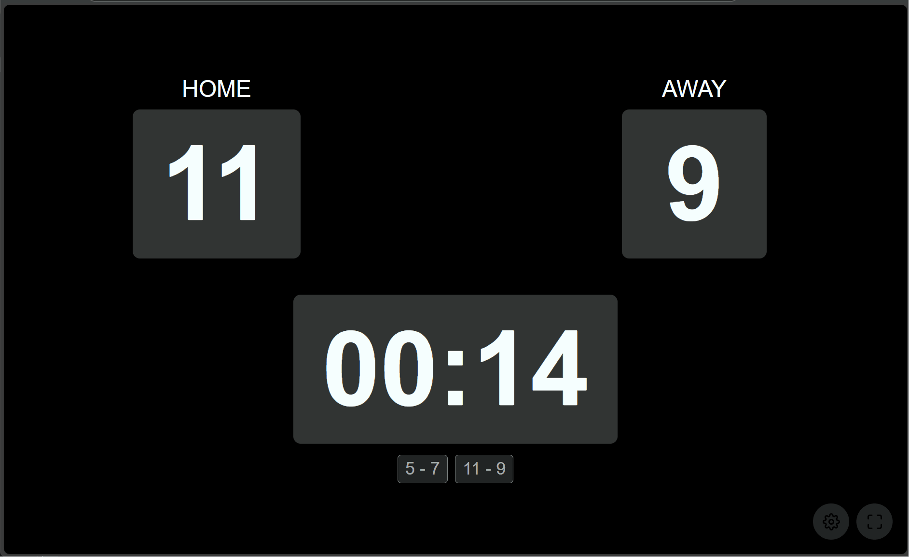

# Scoreboard

A dynamic web-based scoreboard application built as a SharedTools module for ASP.NET Core. This application provides real-time score tracking with persistent storage using Azure Blob Storage.



## Overview

The Scoreboard application is built using a modular architecture that separates the scoreboard functionality into a loadable module (`Scoreboard.App`) and a lightweight host application (`Scoreboard.Web`). This design allows the scoreboard to be:

- **Dynamically loaded** - The module can be loaded at runtime from NuGet packages
- **Self-contained** - All assets, dependencies, and functionality are packaged together
- **Reusable** - Can be easily integrated into other ASP.NET Core applications
- **Isolated** - Module dependencies don't conflict with the host application

## Features

- **Real-time Score Tracking** - Keep track of scores for multiple players
- **Persistent Storage** - Game history saved to Azure Blob Storage
- **Responsive Design** - Works on desktop and mobile devices
- **Audio Feedback** - Buzzer sounds for game events
- **Customizable Players** - Add, remove, and manage player profiles
- **Full-screen Mode** - Optimized display for presentations
- **Rate Limiting** - Built-in protection against API abuse

## Project Structure

```
Scoreboard/
├── src/
│   ├── Scoreboard.App/          # The scoreboard module
│   │   ├── ScoreboardModule.cs  # Module entry point implementing IApplicationPartModule
│   │   ├── ScoreboardApiMethods.cs # API endpoints for the module
│   │   └── wwwroot/            # Static assets (HTML, CSS, JS, audio)
│   │       ├── index.html      # Main scoreboard UI
│   │       ├── app.js          # Client-side JavaScript
│   │       ├── styles.css      # Styling
│   │       ├── audio/          # Sound effects
│   │       └── icons/          # UI icons
│   │
│   └── Scoreboard.Web/         # The host application
│       └── Program.cs          # Minimal host for loading modules
│
├── MODULE_README.md            # SharedTools module system documentation
├── MODULE_PUBLISH.md           # Guide for publishing modules to NuGet
└── MODULE_MIGRATION.md         # Guide for converting projects to modules
```

## Quick Start

### Prerequisites

- .NET 10.0 SDK or later
- Azure Storage Account (or use local development storage)
- Visual Studio 2022 or VS Code (optional)

### Running Locally

1. **Clone the repository**
   ```bash
   git clone https://github.com/andrewboudreau/Scoreboard.git
   cd Scoreboard
   ```

2. **Configure Azure Storage** (optional - for persistence)
   
   Update `src/Scoreboard.Web/appsettings.json`:
   ```json
   {
     "BlobStorage": {
       "ConnectionString": "UseDevelopmentStorage=true",
       "ContainerName": "scoreboard-data"
     }
   }
   ```

3. **Build and run**
   ```bash
   dotnet build
   cd src/Scoreboard.Web
   dotnet run
   ```

4. **Open in browser**
   Navigate to `http://localhost:5000/Scoreboard/`

## Development

### Building the Module

The Scoreboard.App module is automatically packed to the local NuGet feed during Debug builds:

```bash
cd src/Scoreboard.App
dotnet pack -c Debug
```

This outputs the package to `C:\LocalNuGet` for local testing.

### Module Architecture

The scoreboard is implemented as a SharedTools module following these patterns:

1. **Module Class** (`ScoreboardModule.cs`)
   - Implements `IApplicationPartModule`
   - Registers services (Azure Blob Storage, Rate Limiting)
   - Maps API endpoints with `/Scoreboard/` prefix
   - Configures middleware

2. **API Methods** (`ScoreboardApiMethods.cs`)
   - Static methods for handling HTTP requests
   - Upload game history to blob storage
   - Test blob storage connectivity

3. **Static Assets** (`wwwroot/`)
   - Served via `/_content/Scoreboard/` path
   - Includes HTML, CSS, JavaScript, and audio files
   - Packaged as embedded resources in the module

### Testing the Module

The `Scoreboard.Web` project serves as a test host:

```csharp
// Program.cs - Minimal host application
await builder.AddApplicationPartModules(["ScoreboardModule"]);
app.UseApplicationPartModules();
```

## Configuration

### Azure Blob Storage

Configure blob storage in `appsettings.json`:

```json
{
  "BlobStorage": {
    "ConnectionString": "DefaultEndpointsProtocol=https;AccountName=...",
    "ContainerName": "scoreboard-data"
  }
}
```

For local development, use the Azure Storage Emulator:
```json
{
  "BlobStorage": {
    "ConnectionString": "UseDevelopmentStorage=true",
    "ContainerName": "scoreboard-data"
  }
}
```

### Rate Limiting

The module includes built-in rate limiting:
- 6 requests per minute per IP address
- Applied only to `/Scoreboard/` endpoints
- Returns HTTP 429 when limit exceeded

## API Endpoints

- `GET /Scoreboard/` - Main scoreboard UI (redirects to index.html)
- `POST /Scoreboard/api/upload-history` - Upload game history to blob storage
- `GET /Scoreboard/api/test-blob-connection` - Test blob storage connectivity

## Publishing

### To Local NuGet Feed

```bash
cd src/Scoreboard.App
dotnet pack -c Debug
```

### To NuGet.org

1. Update version in `Directory.Build.props`
2. Run the GitHub Actions workflow "Tag and Publish"
3. Package will be published to NuGet.org

See [MODULE_PUBLISH.md](MODULE_PUBLISH.md) for detailed publishing instructions.

## Integration

To use the Scoreboard module in another ASP.NET Core application:

1. **Add NuGet package**
   ```bash
   dotnet add package Scoreboard.App
   ```

2. **Load the module**
   ```csharp
   await builder.AddApplicationPartModules(["ScoreboardModule"]);
   ```

3. **Activate modules**
   ```csharp
   app.UseApplicationPartModules();
   ```

4. **Configure blob storage** in your host's `appsettings.json`

## Contributing

1. Fork the repository
2. Create a feature branch
3. Make your changes
4. Submit a pull request

## License

This project is licensed under the MIT License - see the [LICENSE.txt](LICENSE.txt) file for details.

## Related Documentation

- [SharedTools Module System](MODULE_README.md) - Overview of the module loading system
- [Publishing Modules](MODULE_PUBLISH.md) - Guide for publishing to NuGet
- [Migration Guide](MODULE_MIGRATION.md) - Converting existing projects to modules
- [Architecture Overview](CLAUDE.md) - Detailed technical documentation
